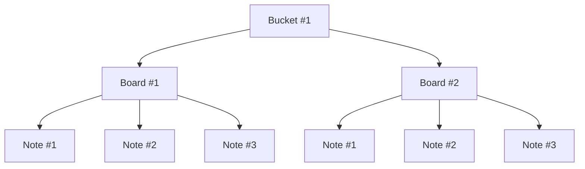

# Ocha

---

Ocha aims to be a cross-platform terminal markdown editor & manager, reminiscent of Obsidian. It allows users to store `notes` & `tasks` in a structured manner, organizing them into `boards` and `buckets`. In this context, a board represents a collection of notes & tasks, and a bucket encapsulates multiple boards. Think of buckets a shelves, boards as notebooks, and notes as pages.



## Implementation

### CLI

ocha uses [urfave/cli](https://github.com/urfave/cli) the CLI framework. It is a very popular framework with a lot of support and documentation. It is also used by kubectl, which is a CLI that I use on a daily basis. It is also used by other popular CLIs such as helm, terraform, and docker.

### Storage

ocha uses a sqlite database to store all of the notes and boards. The database is created in the user's home directory under the `.ocha-cli/` folder. Under the hood, it uses gorm as the [ORM](https://en.wikipedia.org/wiki/Object%E2%80%93relational_mapping) to interact with the db. Take a look at the schema below to get a better understanding of how the data is stored.

> Add schema here

### TUI

## Basic usage

```
ocha <command> [flags]
```

### Notes

```

ocha notes
ocha n

```

#### Subcommands

```

ocha notes list
ocha notes ls

```

List all of the notes (titles) currently saved in the database (optionally make them checkable to edit) it must return an id to the user

```

ocha notes create <name>
ocha notes c <name>

```

Create a new note titled `<name>`

```

ocha notes | n edit

```

it will display a list of all of the notes to the user to choose from

```

ocha notes | n delete --id <id>

```

delte a note using it's `<id>`m if hte id is not passed, the user will be prompted to select a note to delete

```

ocha notes search

```

filter out notes by title

## Table of Contents

### CLI

-   [x] notes
    -   [x] Create
    -   [x] Edit
    -   [x] Rename
    -   [x] Delete
    -   [x] Import
-   [ ] backup
-   [ ] config

### TUI

-   [x] Listing
-   [x] Editing
-   [x] Creating
-   [x] Renaming
-   [x] Markdown view

## Features
